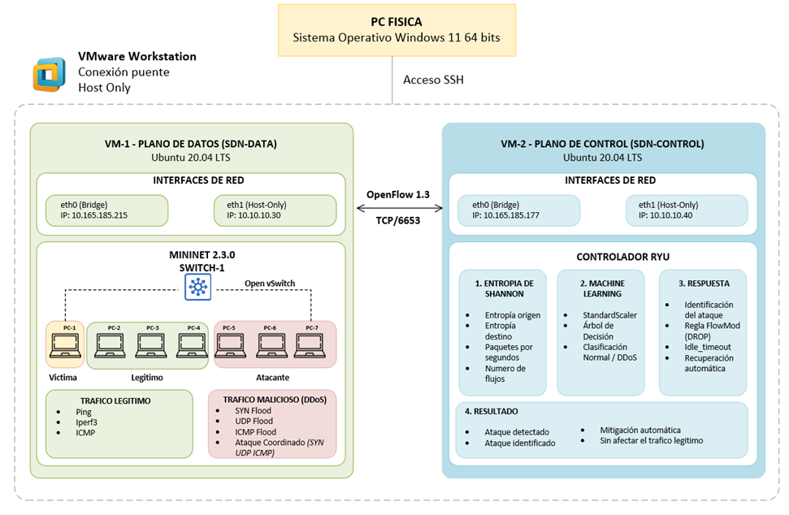
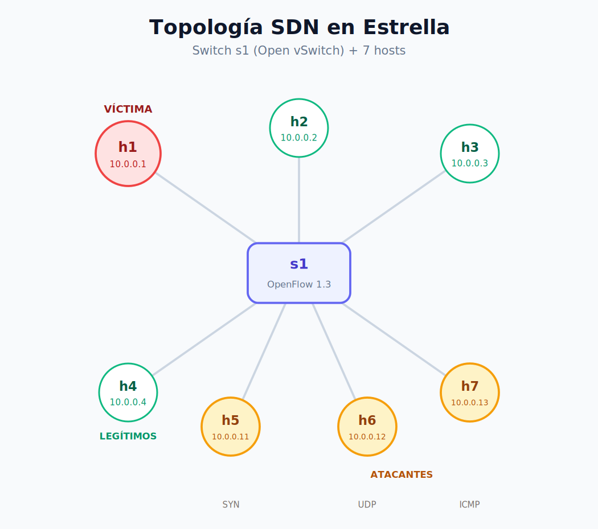
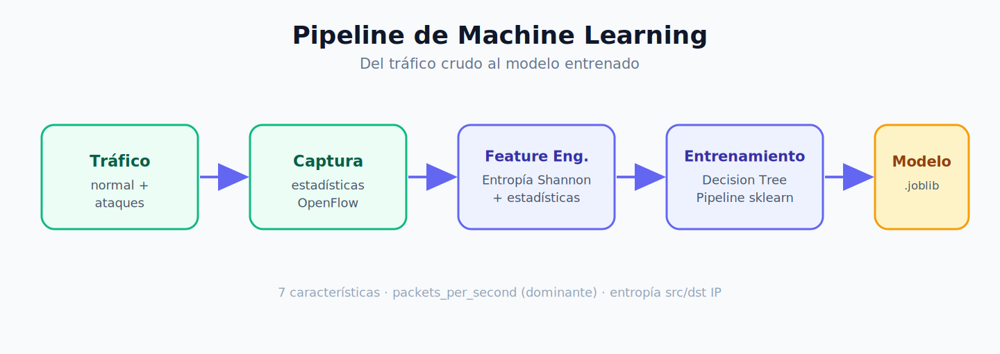
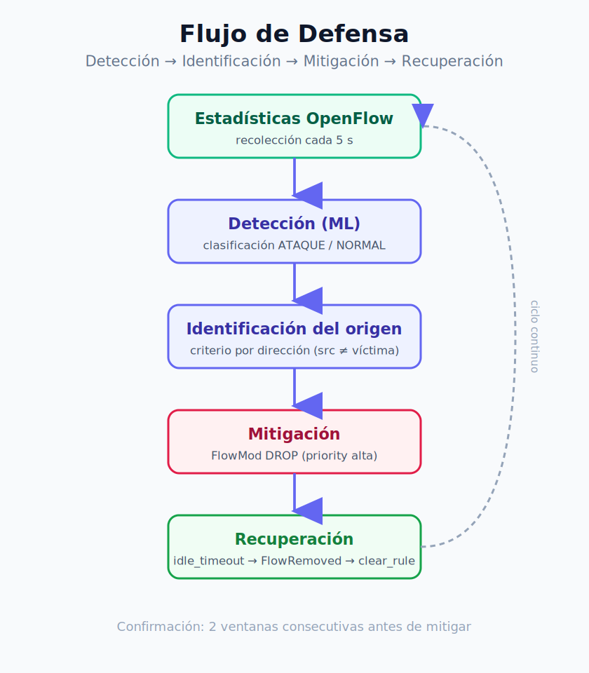

# DDoS-SDN-Defense


## Detección y mitigación de ataques DDoS en redes SDN mediante Entropía de Shannon y Machine Learning

> Proyecto desarrollado en la **Maestría en Ciberseguridad** de la **Universidad Nacional Mayor de San Marcos (UNMSM)**.

El sistema implementa una arquitectura de defensa en tiempo real sobre redes definidas por software (*Software Defined Networking*, SDN), utilizando un controlador **Ryu**, **Mininet** y **OpenFlow 1.3** para detectar ataques DDoS, identificar automáticamente los hosts atacantes e instalar reglas **DROP** dinámicas que mitigan el ataque sin afectar el tráfico legítimo.

La solución incorpora métricas basadas en la **Entropía de Shannon**, características estadísticas del tráfico y modelos de **Machine Learning** entrenados con datos obtenidos en un laboratorio SDN construido específicamente para esta investigación.

---

## Tabla de contenidos

1. [Descripción del proyecto](#1-descripción-del-proyecto)
2. [Objetivos](#2-objetivos)
3. [Contribuciones del proyecto](#3-contribuciones-del-proyecto)
4. [Características principales](#4-características-principales)
5. [Arquitectura del sistema](#5-arquitectura-del-sistema)
6. [Topología SDN](#6-topología-sdn)
7. [Estructura del repositorio](#7-estructura-del-repositorio)
8. [Entorno experimental](#8-entorno-experimental)
9. [Pipeline de Machine Learning](#9-pipeline-de-machine-learning)
10. [Flujo de defensa](#10-flujo-de-defensa)
11. [Validación experimental](#11-validación-experimental)
12. [Tecnologías](#12-tecnologías)
13. [Instalación](#13-instalación)
14. [Inicio rápido](#14-inicio-rápido)
15. [Resultados](#15-resultados)
16. [Roadmap del proyecto](#16-roadmap-del-proyecto)
17. [Contribuciones](#17-contribuciones)
18. [Cómo citar](#18-cómo-citar)
19. [Agradecimientos](#19-agradecimientos)
20. [Licencia](#20-licencia)
21. [Autor](#21-autor)

---

## 1. Descripción del proyecto

Los ataques de denegación de servicio distribuido (DDoS) representan una de las principales amenazas para la disponibilidad de los servicios en redes modernas. En las redes definidas por software (*Software Defined Networking*, SDN), la separación entre el plano de control y el plano de datos permite implementar mecanismos inteligentes de monitoreo, análisis y respuesta desde un controlador centralizado.

Este proyecto presenta un sistema para la **detección y mitigación automática de ataques DDoS en redes SDN**, cuya estrategia de caracterización del tráfico se fundamenta en la **Entropía de Shannon** como principal indicador del comportamiento de la red. Sobre esta caracterización se incorpora un modelo de **Machine Learning**, encargado de clasificar el tráfico y apoyar la toma de decisiones para la respuesta automática.

El sistema implementado es capaz de:

- **Caracterizar** el comportamiento del tráfico mediante métricas basadas en la Entropía de Shannon y estadísticas obtenidas desde OpenFlow.
- **Detectar** ataques DDoS en tiempo real mediante un modelo de Machine Learning entrenado con tráfico normal y malicioso.
- **Identificar** automáticamente el origen del ataque, incluso en escenarios con múltiples atacantes simultáneos.
- **Mitigar** el tráfico malicioso mediante la instalación dinámica de reglas OpenFlow **DROP**, preservando la disponibilidad del tráfico legítimo.
- **Recuperar** automáticamente el estado normal de la red mediante la expiración controlada de las reglas de mitigación y el procesamiento del evento `FlowRemoved`.

El sistema fue implementado y validado experimentalmente sobre un laboratorio SDN reproducible basado en Mininet, Open vSwitch y el controlador Ryu, demostrando una respuesta eficaz frente a distintos escenarios de ataque DDoS.

---

## 2. Objetivos

### Objetivo general

Diseñar e implementar un sistema capaz de detectar, identificar el origen y mitigar automáticamente ataques DDoS sobre redes SDN utilizando métricas basadas en la Entropía de Shannon y técnicas de Machine Learning.

### Objetivos específicos

- Construir un laboratorio SDN reproducible basado en Mininet y Ryu.
- Generar un conjunto de datos representativo de tráfico normal y DDoS.
- Diseñar un pipeline de extracción de características basado en estadísticas OpenFlow y Entropía de Shannon.
- Entrenar y validar modelos de Machine Learning para la clasificación de tráfico.
- Implementar la detección de ataques en tiempo real.
- Identificar automáticamente el origen del ataque, incluso en escenarios distribuidos.
- Mitigar el ataque mediante reglas OpenFlow DROP dinámicas.
- Validar experimentalmente el sistema mediante una campaña de 15 experimentos.

---

## 3. Contribuciones del proyecto

Este trabajo aporta:

- Un **pipeline reproducible** para la detección de ataques DDoS en redes SDN, desde la generación de tráfico hasta la mitigación.
- Un **mecanismo de identificación del origen** del ataque compatible con ataques distribuidos, basado en la dirección del flujo hacia la víctima.
- Un **esquema de mitigación automática** mediante OpenFlow, con recuperación basada en el evento FlowRemoved y sin reglas huérfanas.
- Una **metodología experimental reproducible** basada en marcadores independientes del algoritmo evaluado.
- Una **instrumentación** para medir el tiempo de detección (Td), de mitigación (Tm) y de recuperación (Tr) de forma objetiva.

---

## 4. Características principales

- **Detección basada en Machine Learning**: modelo entrenado sobre características estadísticas del tráfico, con paridad garantizada entre el entrenamiento por lotes (batch) y la inferencia en línea (online).
- **Entropía de Shannon**: cálculo de la entropía de la distribución de flujos por IP como característica discriminante del tráfico.
- **Identificación por dirección**: criterio robusto que identifica al atacante según la dirección del flujo hacia la víctima, escalable a múltiples atacantes simultáneos sin recalibración.
- **Mitigación quirúrgica**: bloqueo exclusivo del tráfico atacante→víctima mediante reglas DROP de alta prioridad, con 0% de pérdida en el tráfico legítimo.
- **Recuperación automática**: ciclo de vida de reglas sincronizado entre el switch y el controlador mediante `OFPFF_SEND_FLOW_REM`, sin reglas huérfanas.
- **Instrumentación experimental reproducible**: herramientas de marcado y análisis independientes del algoritmo evaluado, que producen métricas objetivas por experimento.

---

## 5. Arquitectura del sistema

<!-- 📌 Reemplazar por el diagrama generado: docs/img/arquitectura.png -->


El sistema se despliega sobre dos planos, siguiendo la separación característica de SDN:

- **Plano de control (VM-2):** el controlador Ryu ejecuta la orquestación OpenFlow (`monitor.py`), la extracción de características en línea (`online_detector.py`), la inferencia del modelo de Machine Learning, la identificación del atacante (`attack_identifier.py`) y la mitigación (`mitigator.py`).
- **Plano de datos (VM-1):** Mininet emula la topología, con un switch Open vSwitch que se comunica con el controlador vía OpenFlow 1.3 (puerto 6653).

---

## 6. Topología SDN

<!-- 📌 Reemplazar por el diagrama generado: docs/img/topologia.png -->


Topología en estrella con un switch OpenFlow (s1) y 7 hosts:

| Host | Rol | IP |
|---|---|---|
| h1 | Víctima | 10.0.0.1 |
| h2 | Tráfico legítimo | 10.0.0.2 |
| h3 | ATráfico legítimo | 10.0.0.3 |
| h4 | Tráfico legítimo | 10.0.0.4 |
| h5 | Atacante (SYN Flood) | 10.0.0.11 |
| h6 | Atacante (UDP Flood) | 10.0.0.12 |
| h7 | Atacante (ICMP Flood) | 10.0.0.13 |

---

## 7. Estructura del repositorio

```
ddos-sdn-defense/
│
├── controller/              # Plano de control (VM-2, Ryu)
│   ├── apps/                # monitor, detector, identificador, mitigador
│   ├── experiments/         # instrumentación experimental (Hito 10)
│   └── logs/                # logs de ejecución (no versionados)
│
├── data-plane/              # Plano de datos (VM-1, Mininet)
│   ├── topologia/           # definición de la topología SDN
│   ├── trafico/             # generación de tráfico y ataques
│   └── capturas/            # capturas de tráfico
│
├── dataset/                 # datos del pipeline
│   ├── raw/                 # capturas crudas
│   ├── processed/           # dataset limpio
│   └── ventanas/            # features por ventana
│
├── models/                  # artefactos de Machine Learning
│   ├── trained/             # modelo entrenado (.joblib)
│   └── metrics/             # métricas y figuras de evaluación
│
├── docs/                    # documentación de instalación y reproducción
│   └── img/                 # diagramas y capturas
├── results/                 # resultados experimentales (tablas, CSV, informes)
├── scripts/                 # utilidades auxiliares
│
├── README.md
├── requirements.txt
└── LICENSE
```

> **Nota sobre el despliegue:** el repositorio se clona completo en ambas máquinas virtuales. VM-1 (plano de datos) utiliza `data-plane/`; VM-2 (plano de control) utiliza `controller/`. Los directorios `dataset/` y `models/` son artefactos compartidos del pipeline, no exclusivos de una máquina.

---

## 8. Entorno experimental

El laboratorio se construyó sobre dos máquinas virtuales en VMware Workstation Pro:

| Componente | VM-1 (Plano de datos) | VM-2 (Plano de control) |
|---|---|---|
| Rol | Mininet + Open vSwitch | Ryu + Machine Learning |
| IP de gestión | 10.10.10.30 | 10.10.10.40 |
| Sistema operativo | Ubuntu 20.04 | Ubuntu 20.04 |
| Python | 3.8.10 | 3.8.10 (venv) |
| Software clave | Mininet 2.3.0, OVS 2.13.8 | Ryu 4.34, scikit-learn 1.3.2 |

---

## 9. Pipeline de Machine Learning

<!-- 📌 Reemplazar por el diagrama generado: docs/img/pipeline_ml.png -->


```
Generación de tráfico  →  Captura  →  Feature Engineering  →  Entrenamiento  →  Modelo
   (normal + ataques)      (OVS)      (entropía + stats)      (Decision Tree)   (.joblib)
```

**Modelo operativo:** el sistema utiliza un **Pipeline de scikit-learn** compuesto por un `StandardScaler` y un `DecisionTreeClassifier`:

```python
Pipeline([
    ('scaler', StandardScaler()),
    ('model', DecisionTreeClassifier(class_weight='balanced',
                                     max_depth=5,
                                     min_samples_leaf=2,
                                     random_state=42))
])
```

El modelo se implementó mediante un pipeline de Machine Learning que garantiza la misma transformación de características durante el entrenamiento y la inferencia. Aunque el algoritmo Decision Tree no requiere escalado de características para su funcionamiento, el uso del pipeline asegura la consistencia del procesamiento de datos y facilita la sustitución por otros modelos (por ejemplo, SVM, KNN o Logistic Regression) que sí lo requieren. Los hiperparámetros (`max_depth=5`, `class_weight='balanced'`, `min_samples_leaf=2`) favorecen la interpretabilidad, el manejo del desbalance de clases y la robustez frente al sobreajuste; `random_state=42` garantiza la reproducibilidad.

**Características utilizadas:** el modelo opera sobre 7 características estadísticas del tráfico por ventana, entre ellas `packets_per_second` (la de mayor importancia), `bytes_per_second`, y la **entropía de Shannon** de la distribución de IPs de origen y destino.

**Garantía de paridad:** la lógica de cálculo de características es compartida entre el entrenamiento por lotes (batch) y la inferencia en línea (online), lo que garantiza que el modelo recibe en producción exactamente el mismo tipo de datos con los que fue entrenado.

---

## 10. Flujo de defensa

<!-- 📌 Reemplazar por el diagrama generado: docs/img/flujo_mitigacion.png -->


```
Estadísticas OpenFlow  →  Feature Engineering  →  Detección (ML)
                                                        │
                                                   ¿ATAQUE?
                                                        │
                              Identificación del origen ◀┘
                                        │
                              FlowMod DROP (mitigación)
                                        │
                              idle_timeout → FlowRemoved
                                        │
                              clear_rule (recuperación)
```

---

## 11. Validación experimental

El sistema fue validado mediante una campaña de **15 experimentos** (5 escenarios × 3 repeticiones), ejecutados bajo un protocolo uniforme implementado con un orquestador que estandariza los tiempos y marcadores, manteniendo manual la generación del tráfico y los ataques (para no introducir automatismos que alteren el comportamiento evaluado).

| Escenario | Atacante(s) | Tipo |
|---|---|---|
| Normal | ninguno | tráfico legítimo (control) |
| SYN Flood | h5 | inundación TCP SYN |
| ICMP Flood | h7 | inundación ICMP |
| UDP Flood | h6 | inundación UDP |
| Coordinado | h5 + h6 + h7 | ataque distribuido simultáneo |

**Métricas medidas:** tiempo de detección (Td), tiempo de mitigación (Tm), tiempo de recuperación (Tr), falsos positivos, falsos negativos, disponibilidad del tráfico legítimo y ciclo de vida de las reglas.

---

## 12. Tecnologías

| Tecnología | Uso |
|---|---|
| Python 3.8 | Lenguaje de desarrollo |
| Ryu 4.34 | Controlador SDN |
| OpenFlow 1.3 | Protocolo de comunicación controlador–switch |
| Mininet 2.3.0 | Emulación de la red |
| Open vSwitch 2.13.8 | Switch programable |
| scikit-learn 1.3.2 | Machine Learning |
| pandas / NumPy | Procesamiento y cálculo de datos |
| joblib | Persistencia del modelo |
| hping3 | Generación de tráfico de ataque |
| VMware Workstation | Virtualización del laboratorio |

---

## 13. Instalación

La instalación detallada paso a paso está en la carpeta [`docs/`](docs/):

- [`docs/01-Requisitos.md`](docs/01-Requisitos.md) — requisitos de hardware y software
- [`docs/02-Instalacion-VM1.md`](docs/02-Instalacion-VM1.md) — Mininet + Open vSwitch
- [`docs/03-Instalacion-VM2.md`](docs/03-Instalacion-VM2.md) — Ryu + entorno Python
- [`docs/04-Configuracion-Red.md`](docs/04-Configuracion-Red.md) — configuración de red entre VMs

**Resumen rápido (VM-2, plano de control):**

```bash
git clone https://github.com/jhon-capcha/ddos-sdn-defense.git
cd ddos-sdn-defense
python3 -m venv venv
source venv/bin/activate
pip install -r requirements.txt
```

---

## 14. Inicio rápido

Guía completa en [`docs/05-Ejecucion-Laboratorio.md`](docs/05-Ejecucion-Laboratorio.md).

**1. Arrancar el controlador (VM-2):**
```bash
source venv/bin/activate
APP_MODE=detect_mitigate ryu-manager --ofp-tcp-listen-port 6653 controller/apps/monitor.py
```

**2. Levantar la topología (VM-1):**
```bash
sudo python3 data-plane/topologia/topologia_ddos.py
```

**3. Generar un ataque (VM-1, en el prompt de Mininet):**
```
h5 hping3 -S -p 80 -i u1000 10.0.0.1 &
```

El controlador detectará el ataque, identificará al atacante (h5) e instalará una regla DROP automáticamente.

---

## 15. Resultados

Resultados de la campaña experimental (media ± desviación estándar):

| Escenario | Td (s) | Tm (s) | Tr (s) | DROP | FP |
|---|---|---|---|---|---|
| SYN Flood | 6.7 ± 1.5 | 11.7 ± 1.5 | 13.3 ± 0.6 | 1 | 0 |
| ICMP Flood | 2.3 ± 1.2 | 7.3 ± 1.2 | 13.7 ± 0.6 | 1 | 0 |
| UDP Flood | 5.0 ± 0.0 | 10.0 ± 0.0 | 13.7 ± 0.6 | 1 | 0 |
| Coordinado | 6.3 ± 1.5 | 11.3 ± 1.5 | — † | 3 | 0 |
| Normal | — | — | — | 0 | 0 |

**Rendimiento del identificador de atacantes:**

| Métrica | Valor |
|---|---|
| Verdaderos positivos (TP) | 18 |
| Falsos positivos (FP) | 0 |
| Falsos negativos (FN) | 0 |
| Precisión | 1.00 |
| Recall | 1.00 |
| F1-score | 1.00 |

**Hallazgos clave:**
- Detección, identificación y mitigación exitosas en el 100% de los ataques (12/12).
- El escenario coordinado identificó y bloqueó a los 3 atacantes simultáneos (escalabilidad validada).
- Cero falsos positivos en tráfico legítimo.
- 0% de pérdida en el tráfico legítimo durante la mitigación.
- Recuperación automática de todas las reglas (18/18).

† *El Tr del escenario coordinado requiere una consideración especial de medición (múltiples reglas); ver documentación de resultados.*

Detalle completo en [`results/`](results/) y en [`docs/06-Reproducir-Hito10.md`](docs/06-Reproducir-Hito10.md).

---

## 16. Roadmap del proyecto

| Hito | Descripción | Estado |
|---|---|---|
| 1–5 | Laboratorio SDN, generación de tráfico y dataset | ✅ |
| 6 | Feature engineering (entropía + estadísticas) | ✅ |
| 7 | Entrenamiento y evaluación de modelos ML | ✅ |
| 8 | Detección en tiempo real | ✅ |
| 9 | Identificación del origen y mitigación | ✅ |
| 10 | Validación experimental integral | ✅ |
| 11 | Consolidación, documentación y artículo | ✅ |

**Trabajo futuro:**
- Extensión a escenarios con *IP spoofing*, donde la entropía de origen recuperaría valor discriminante.
- Evaluación de calidad de servicio (QoS) con `iperf`.
- Escalado a topologías de mayor tamaño.

---

## 17. Contribuciones

Actualmente este proyecto forma parte de una investigación de maestría. Las contribuciones externas serán bienvenidas una vez concluida la investigación. Si deseas reportar un problema o sugerir una mejora, puedes abrir un *issue* en el repositorio.

---

## 18. Cómo citar

Si este trabajo es útil para tu investigación, puedes citarlo como:

```bibtex
@misc{ddos_sdn_shannon_2026,
  title = {Sistema de detección, identificación del origen y mitigación automática de ataques DDoS en redes SDN mediante Entropía de Shannon y Machine Learning},
  author = {
    Jhon Kenedy Capcha Salas and
    Ludwin Ciro Coñes Falcon and
    Rosembert Gamboa Ventura and
    Luis Angel Mayta Chipana
  },
  year = {2026},
  institution = {Universidad Nacional Mayor de San Marcos},
  note = {Proyecto académico desarrollado para la Maestría en Ciberseguridad},
  url = {https://github.com/jhon-capcha/ddos-sdn}
}
```

> El artículo asociado (formato IEEE) y su DOI se añadirán aquí tras su publicación.

---

## 19. Agradecimientos

- **Universidad Nacional Mayor de San Marcos (UNMSM)**
- **Maestría en Ciberseguridad**
- Curso: *Programación Aplicada a la Ciberseguridad* — Prof. Dr. Krishnendu Rarhi


---

## 20. Licencia

Este proyecto se distribuye bajo la licencia **MIT**. Ver el archivo [`LICENSE`](LICENSE) para más detalles.

---

## 21. Equipo de proyecto
* Jhon Kenedy Capcha Salas (jhon.capchas@unmsm.edu.pe)
* Ludwin Ciro Coñes Falcon (ludwig.conesf@unmsm.edu.pe)
* Rosembert Gamboa Ventura (rosembert.gamboav@unmsm.edu.pe)
* Luis Angel Mayta Chipana (luis.mayta@unmsm.edu.pe)


---

*Proyecto desarrollado como trabajo final del curso Programación Aplicada a la Ciberseguridad, perteneciente a la Maestría en Ciberseguridad de la Universidad Nacional Mayor de San Marcos.*
